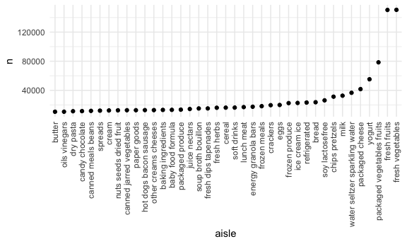
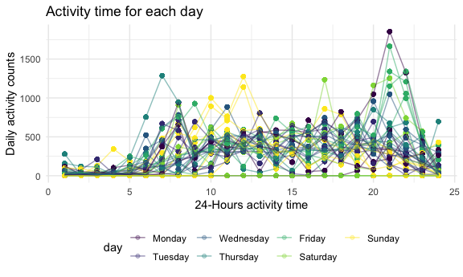
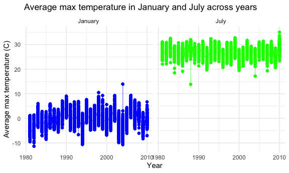
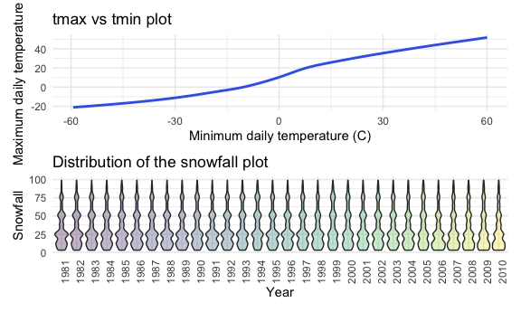

p8105\_hw3\_qx2199
================
Qianhui Xu
2020-10-08

## Problem 1

Load the Instacart data.

``` r
data("instacart")
```

The Instacart dataset contains 1384617 rows and 15 columns.

Observations are the level of items in orders by user. There are user /
order variables – user ID, order ID, order day, and order hour. There
are also item variables – product ID, product name, aisle, department,
and some numeric codes.

How many aisles, and which are most items from?

``` r
instacart %>% 
    count(aisle) %>% 
    arrange(desc(n))
```

    ## # A tibble: 134 x 2
    ##    aisle                              n
    ##    <chr>                          <int>
    ##  1 fresh vegetables              150609
    ##  2 fresh fruits                  150473
    ##  3 packaged vegetables fruits     78493
    ##  4 yogurt                         55240
    ##  5 packaged cheese                41699
    ##  6 water seltzer sparkling water  36617
    ##  7 milk                           32644
    ##  8 chips pretzels                 31269
    ##  9 soy lactosefree                26240
    ## 10 bread                          23635
    ## # … with 124 more rows

As we can see, there are 134 aisles, and " fresh vegetables "are which
the most items from.

Make a plot that shows the number of items ordered in each aisle,
limiting this to aisles with more than 10000 items ordered. Arrange
aisles sensibly, and organize the plot.

``` r
instacart %>% 
    count(aisle) %>% 
    filter(n > 10000) %>% 
    mutate(
        aisle = factor(aisle),
        aisle = fct_reorder(aisle, n)
    ) %>% 
    ggplot(aes(x = aisle, y = n)) + 
    geom_point() + 
    theme(axis.text.x = element_text(angle = 90, vjust = 0.5, hjust = 1))
```



The top 2 aisles are “fresh vegetables” and “fresh fruits”.

Make a table showing the three most popular items in each of the aisles
“baking ingredients”, “dog food care”, and “packaged vegetables
fruits”. Include the number of times each item is ordered in the
table.

``` r
instacart %>% 
  filter(aisle %in% c("baking ingredients", "dog food care", "packaged vegetables fruits")) %>% 
  group_by(aisle) %>% 
  count(product_name) %>% 
  mutate(rank = min_rank(desc(n))) %>% 
  filter(rank < 4) %>% 
  arrange(aisle, rank) %>% 
  knitr::kable()
```

| aisle                      | product\_name                                 |    n | rank |
| :------------------------- | :-------------------------------------------- | ---: | ---: |
| baking ingredients         | Light Brown Sugar                             |  499 |    1 |
| baking ingredients         | Pure Baking Soda                              |  387 |    2 |
| baking ingredients         | Cane Sugar                                    |  336 |    3 |
| dog food care              | Snack Sticks Chicken & Rice Recipe Dog Treats |   30 |    1 |
| dog food care              | Organix Chicken & Brown Rice Recipe           |   28 |    2 |
| dog food care              | Small Dog Biscuits                            |   26 |    3 |
| packaged vegetables fruits | Organic Baby Spinach                          | 9784 |    1 |
| packaged vegetables fruits | Organic Raspberries                           | 5546 |    2 |
| packaged vegetables fruits | Organic Blueberries                           | 4966 |    3 |

The top 3 items in baking ingredients aisle are “Light Brown Sugar”,
“Pure Baking Soda”, and “Cane Sugar”.

The top 3 items in dog food care aisle are “Snack Sticks Chicken & Rice
Recipe Dog Treats”, “Organix Chicken & Brown Rice Recipe”, and “Small
Dog Biscuits”.

The top 3 items in packaged vegetables fruits aisle are “Organic Baby
Spinach”, “Organic Raspberries”, and “Organic Blueberries”.

Make a table showing the mean hour of the day at which Pink Lady Apples
and Coffee Ice Cream are ordered on each day of the week; format the
table as a 2 x 7 table.

``` r
instacart %>% 
    filter(product_name %in% c("Pink Lady Apples", "Coffee Ice Cream")) %>% 
    group_by(product_name, order_dow) %>% 
    summarize(mean_hour = mean(order_hour_of_day)) %>% 
    pivot_wider(
        names_from = order_dow,
        values_from = mean_hour
    )
```

    ## `summarise()` regrouping output by 'product_name' (override with `.groups` argument)

    ## # A tibble: 2 x 8
    ## # Groups:   product_name [2]
    ##   product_name       `0`   `1`   `2`   `3`   `4`   `5`   `6`
    ##   <chr>            <dbl> <dbl> <dbl> <dbl> <dbl> <dbl> <dbl>
    ## 1 Coffee Ice Cream  13.8  14.3  15.4  15.3  15.2  12.3  13.8
    ## 2 Pink Lady Apples  13.4  11.4  11.7  14.2  11.6  12.8  11.9

## Problem 2

Load, tidy, and otherwise wrangle the accelerometers data

``` r
accel_df = read.csv('./accel_data.csv') %>% 
  janitor::clean_names() %>% 
  pivot_longer(
    activity_1:activity_1440,
    names_to = "minute",
    names_prefix = "activity.",
    values_to = "activity_counts"
  ) %>% 
mutate(day = factor (day, levels = c ("Monday","Tuesday","Wednesday","Thursday","Friday","Saturday","Sunday")))%>%

  mutate(day_type = case_when(
      day %in% c("Monday", "Tuesday", "Wednesday", "Thursday", "Friday") ~ "weekday",
      day %in% c("Saturday", "Sunday")~ "weekend")) %>%

  mutate(minute = as.numeric(minute)) %>%
arrange(week,day)
```

data discription: The tidy accelerometers dataset include 6 variables
and 50400 rows.The variable names are ‘week’, ‘day’,‘minute’,‘activity
counts’ ‘day id’ and ‘day type’.

Using your tidied dataset, aggregate accross minutes to create a total
activity variable for each day, and create a table showing these totals.

``` r
accel_df_new = accel_df %>% 
  group_by(week, day) %>% 
  summarise(total_activity_per_day = sum(activity_counts)) %>% 
  arrange(week, day) %>% 
pivot_wider(
  names_from = day,
  values_from = total_activity_per_day
)  
```

    ## `summarise()` regrouping output by 'week' (override with `.groups` argument)

The person tends to have a relative stable activities during the
weekdays, especially on Tuesdays and Wednesdays.Also, the person has
relatively more activities on Fridays.

Make a single-panel plot that shows the 24-hour activity time courses
for each day and use color to indicate day of the week. Describe in
words any patterns or conclusions you can make based on this graph.

``` r
accel_df %>% 
    mutate(
    hour = ceiling(minute/60)
  ) %>% 
  group_by (hour, day_id) %>% 
  mutate(mean_activity_counts = mean(activity_counts)) %>% 
  ggplot(aes(x = hour, y = mean_activity_counts, colour = day, group = day_id)) + geom_point(alpha= 0.3) +geom_line(alpha=0.5)+
    labs( title = "Activity time for each day ",
      x = "24-Hours activity time",
      y = "Daily activity counts"
    )
```


From the graph we could see that the person have relatively more
activities on Fridays and more activities on the evening of Friday. On
Sundays the person are more likely to take exercise from 10am to 1 pm.
Also, the the peak for activities are mainly from 6am to 1pm,and from
7pm to 10 pm. The person has relativly less activity at around 3 pm.

\#\#Problem 3

Do data cleaning. Create separate variables for year, month, and day.

``` r
data("ny_noaa")
noaa_df = ny_noaa %>% 
janitor::clean_names() %>%  
separate(date, into = c("year", "month", "day"), sep = "-", convert = TRUE) %>% 
mutate(year = as.integer(year),
     month = as.integer(month),
     day = as.integer(day)) %>%
mutate(tmax = as.numeric(tmax),
         tmin = as.numeric(tmin)
         ) %>%
mutate(month = month.name[month]) %>%
mutate(tmax = tmax/10,tmin = tmin/10,prcp = prcp/10) 
```

Discription of the dataset: The `noaa_df` dataset has 2595176 rows and 9
columns. The variable names are `id`for weather station ID , `year` for
observation year, `month` for observation month `day`for observation
day, `prcp`for precipitation（the value needs to be devided by ten when
transfer to mm scale),`snow`for snowfall in mm,`snwd`for snow depth in
mm,`tmax`for maximum temperature (the value needs to be devided by ten
in Celsius scale), and`tmin`for minimum temperature (the value needs to
be devided by ten in Celsius scale)

For snowfall, the most commonly observed values are:

``` r
noaa_df %>% 
count(snow) %>%
arrange(desc(n))
```

    ## # A tibble: 282 x 2
    ##     snow       n
    ##    <int>   <int>
    ##  1     0 2008508
    ##  2    NA  381221
    ##  3    25   31022
    ##  4    13   23095
    ##  5    51   18274
    ##  6    76   10173
    ##  7     8    9962
    ##  8     5    9748
    ##  9    38    9197
    ## 10     3    8790
    ## # … with 272 more rows

As we can see, the the most commonly observed values for snowfall are
0.I think this is because in the most time of the year, there are no
snowfalls.

Make a two-panel plot showing the average max temperature in January and
in July in each station across years.

``` r
noaa_df %>% 
  filter(month == c("January", "July")) %>% 
  group_by(id, year, month) %>%
  mutate(
    mean_tmax = mean(tmax, na.rm = TRUE)) %>%
  ggplot(aes(x = year, y = mean_tmax, color = month)) + 
  geom_point(alpha = 0.3) +  geom_line(alpha = 0.5) +
  facet_grid(~month) +
  theme(legend.position="none") +
  scale_color_manual(values=c("blue", "green")) + labs(
    title = "Average max temperature in January and July across years",
    x = "Year",
    y = "Average max temperature (C)"
    ) 
```

    ## Warning: Removed 92546 rows containing missing values (geom_point).



As we can see, the average max temperature in Janurary is lower than
that in July , and the temperature in both months fluctuates each year.
In January the max average tempreature are mainly fluctuate around 0
(Celsius), in July the max average tempreature are mainly fluctuate
around 27 (Celsius). The max mean temperatures in Januraries are more
fluctuable than the max mean temperature in Julys, There are outlier in
the two graphs. In January, there is a high outlier which is about 13
(Celsius). In July, there are two low outliers, one is around
13(Celsius) and another is around 17(Celsius).

Make a two-panel plot showing (i) tmax vs tmin for the full dataset

``` r
tmax_vs_tmin =
  noaa_df %>% 
  ggplot(aes(x = tmin, y = tmax))+
    geom_smooth(se = FALSE) +
    labs(
      title = "tmax vs tmin plot",
      x = "Minimum daily temperature (C)",
      y = "Maximum daily temperature (C)" )

snow_distri  =
  noaa_df %>% 
  filter(snow < 100 , snow > 0) %>%
  mutate(year = as.factor(year)) %>%
  ggplot(aes(x = year, y = snow)) + 
  geom_violin(aes(fill = year), alpha = 0.3 )+
  labs(
      title = "Distribution of the snowfall plot",
      x = "Year",
      y = "Snowfall"
    )+
  theme(axis.text.x = element_text(angle = 90), legend.position="none")

tmax_vs_tmin / snow_distri
```

    ## `geom_smooth()` using method = 'gam' and formula 'y ~ s(x, bs = "cs")'

    ## Warning: Removed 1136276 rows containing non-finite values (stat_smooth).


